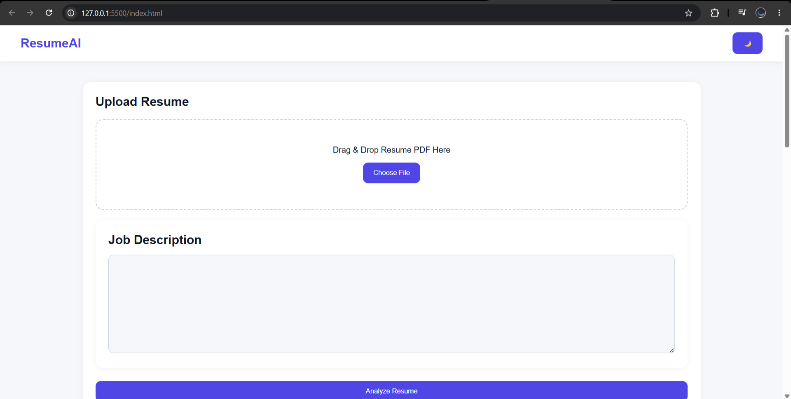
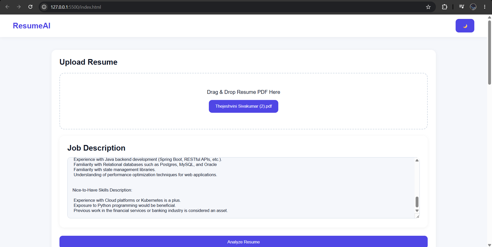
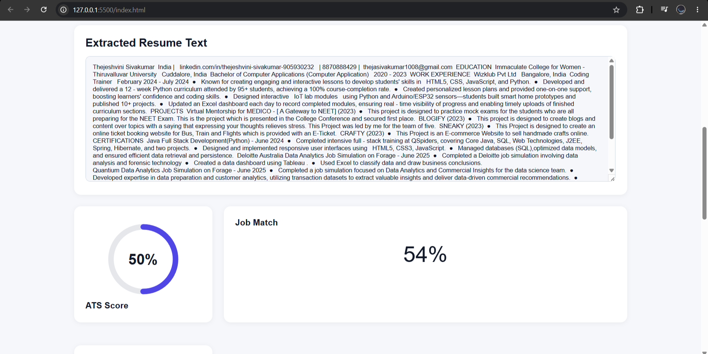
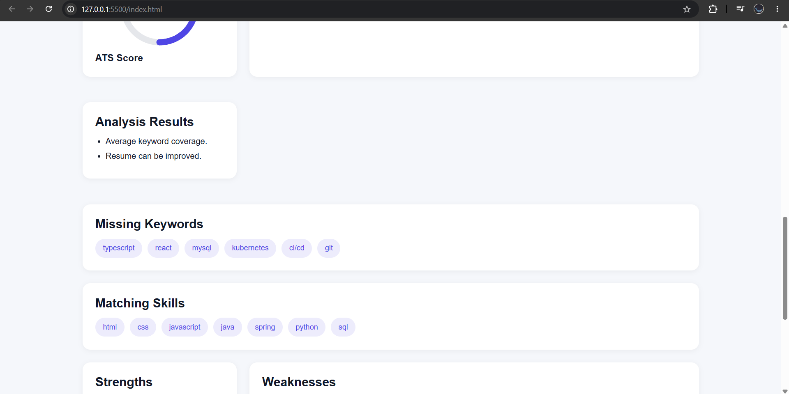
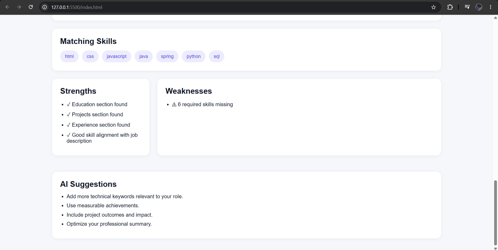
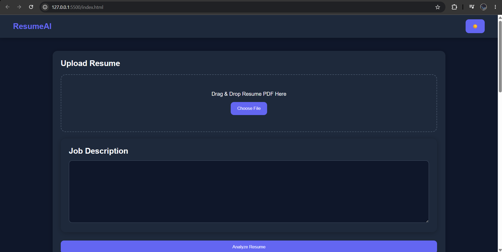

# AI Resume Analyzer

AI-powered Resume Analyzer built with HTML, CSS, JavaScript, and PDF.js.

Analyze resumes against job descriptions, calculate ATS scores, identify missing skills, and generate actionable recommendations.

---

## Features

✅ PDF Resume Upload

✅ Resume Text Extraction using PDF.js

✅ ATS Score Calculation

✅ Job Description Matching

✅ Matching Skills Detection

✅ Missing Skills Detection

✅ Strengths & Weaknesses Analysis

✅ Resume Improvement Suggestions

✅ Dark Mode Support

✅ Responsive Design

---

## Screenshots

### Homepage



### Resume Analysis









### Dark Mode



---

## Tech Stack

### Frontend

* HTML5
* CSS3
* JavaScript (ES6)

### Libraries

* PDF.js

---

## Project Workflow

Upload Resume PDF

↓

Extract Resume Text

↓

Analyze Resume

↓

Compare with Job Description

↓

Generate ATS Score

↓

Display Insights & Recommendations

---

## Installation

Clone the repository:

```bash
git clone https://github.com/YOUR_USERNAME/ai-resume-analyzer.git
```

Open:

```bash
index.html
```

or run using VS Code Live Server.

---

## Future Improvements

* Gemini AI Integration
* OpenAI Integration
* PDF Report Generation
* Resume History Tracking
* Recruiter Dashboard
* Authentication System

---

## Author

Thejasiva
